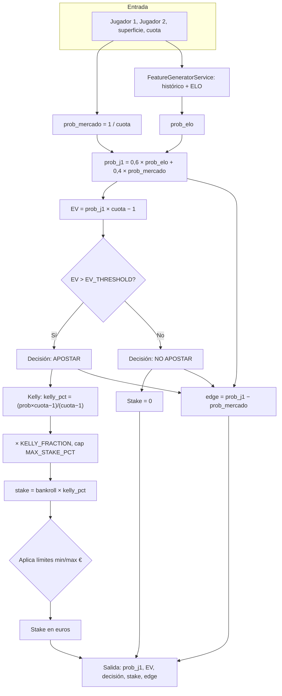

# Documentación técnica — Tenly

Documentación técnica del proyecto **Tenly**: arquitectura, backend, API, modelo de predicción, despliegue en Railway, APIs externas y frontend.

---

## 1. Visión general del proyecto

**Tenly** es el nombre del producto. El proyecto consta de tres partes principales:

| Componente | Descripción |
|------------|-------------|
| **tennis-ml-predictor** | Backend en Python (FastAPI): API REST de Tenly, predicciones, base de datos, jobs automáticos e integración con APIs de tenis. |
| **tennis-ml-frontend** | App Tenly (Expo / React Native): pantallas de partidos, predicciones, apuestas, torneos, favoritos y cuenta. |
| **tennis-ml-landing** | Landing y callback de autenticación (p. ej. `auth/callback` para Supabase). |

La app Tenly consume la API del predictor (desplegada en Railway) y usa Supabase para autenticación y datos de usuario (favoritos, bankroll, etc.).

---

## 2. Backend (tennis-ml-predictor)

### 2.1 Stack y estructura

- **Framework:** FastAPI.
- **Servidor:** Uvicorn (`uvicorn src.api.api_v2:app --host 0.0.0.0 --port 8000`).
- **Base de datos:** SQLite en desarrollo local; **PostgreSQL** en producción (Railway) si está definida la variable `DATABASE_URL`.
- **Configuración:** Variables de entorno (`.env`) y clase `Config` en `src/config/settings.py`.

Estructura relevante:

```
tennis-ml-predictor/
├── src/
│   ├── api/           # FastAPI: api_v2.py, routes_match_detail.py, modelos Pydantic
│   ├── config/        # settings.py (env, Config)
│   ├── database/      # match_database.py (SQLite + PostgreSQL), schema_v2.sql
│   ├── prediction/    # predictor_calibrado.py, feature_generator_service.py
│   ├── features/      # ELO, forma, H2H, superficie, etc.
│   ├── services/      # api_tennis_client, match_update_service, odds_update_service, etc.
│   ├── automation/    # daily_match_fetcher, jobs
│   └── utils/
├── datos/             # raw/ (CSV TML), processed/, cache
├── scripts/           # backtesting, verificación, importación
├── Dockerfile
├── railway.json
├── start.sh
└── requirements.txt
```

### 2.2 Modelo de predicción (baseline ELO + mercado)

En producción **no se usa un modelo ML (.pkl)**. Las predicciones se calculan con un **baseline** que combina la fuerza relativa de los jugadores (ELO) y lo que el mercado de apuestas refleja en las cuotas. A partir de ahí se obtiene una probabilidad, un valor esperado (EV), una decisión (apostar o no) y una cantidad recomendada (stake Kelly).

#### Glosario (jerga de apuestas y del modelo)

| Término | Significado |
|--------|-------------|
| **Cuota** | Número que la casa de apuestas paga por cada euro apostado si aciertas (ej.: cuota 2.10 → apostas 10€ y ganas 21€, beneficio 11€). |
| **Probabilidad implícita (del mercado)** | Lo que el mercado “cree” que es la probabilidad de victoria. Se calcula como **1 / cuota**. Si la cuota del jugador 1 es 2.00, la probabilidad implícita es 1/2 = 50%. |
| **ELO** | Sistema de puntuación que mide la fuerza de un jugador según sus resultados históricos. A más ELO, más fuerte. A partir del ELO de ambos jugadores se calcula la **probabilidad esperada** de que uno gane (prob_elo). |
| **prob_elo** | Probabilidad de victoria del jugador 1 según el sistema ELO y el histórico de partidos (CSV o BD). |
| **EV (Expected Value / Valor esperado)** | Beneficio medio por euro apostado si repitiéramos la apuesta muchas veces. **EV = (probabilidad que nosotros damos × cuota) − 1**. Si EV > 0, la apuesta es “rentable” en expectativa. Ej.: si damos 55% y la cuota es 2.00, EV = 0.55×2 − 1 = 0.10 (10 céntimos de beneficio esperado por euro). |
| **EV_THRESHOLD** | Umbral mínimo de EV para recomendar la apuesta. Por defecto 0.03 (3%). Solo se recomienda **APOSTAR** si EV > EV_THRESHOLD. |
| **Edge** | Ventaja que creemos tener sobre la casa: **edge = nuestra probabilidad − probabilidad implícita**. Si damos 55% y el mercado 50%, edge = 5%. |
| **Bankroll** | Banca o dinero total que el usuario destina a apuestas (ej.: 1000€). |
| **Stake** | Cantidad en euros que se recomienda apostar en esa apuesta. |
| **Kelly (criterio de Kelly)** | Regla para calcular qué porcentaje del bankroll apostar según la ventaja (edge) y la cuota. Maximiza el crecimiento a largo plazo pero puede ser agresivo; por eso usamos una **fracción** de Kelly (ej. 5%). |
| **KELLY_FRACTION** | Por defecto 0.05 (5% Kelly): solo apostamos el 5% del “Kelly completo” para ser conservadores. |
| **Límites del stake** | Se aplican mínimo (ej. 5€), máximo % del bankroll (ej. 10%) y máximo € por apuesta (ej. 250€) para no arriesgar demasiado en una sola jugada. |

#### Cómo se calcula la predicción (paso a paso)

1. **Probabilidad del mercado (prob_mercado)**  
   Para el jugador 1: `prob_mercado = 1 / cuota_j1`.  
   Ej.: cuota 2.10 → prob_mercado = 1/2.10 ≈ 0.476 (47,6%).

2. **Probabilidad ELO (prob_elo)**  
   El `FeatureGeneratorService` carga el histórico de partidos (CSV en `datos/raw/` o partidos completados en la BD), calcula el ELO de cada jugador y obtiene la probabilidad esperada de que el jugador 1 gane según ese ELO. Ese valor es `prob_elo` (entre 0 y 1).

3. **Probabilidad final del modelo**  
   Se combinan ELO y mercado con un peso configurable:
   ```
   prob_j1 = BASELINE_ELO_PESO × prob_elo + (1 − BASELINE_ELO_PESO) × prob_mercado
   ```
   Por defecto `BASELINE_ELO_PESO = 0.6` (60% ELO, 40% mercado). Así no dependemos solo del mercado ni solo del histórico.

4. **Valor esperado (EV)**  
   `EV = (prob_j1 × cuota_j1) − 1`.  
   Si EV > 0, en expectativa la apuesta es rentable.

5. **Decisión**  
   **APOSTAR** si `EV > EV_THRESHOLD` (p. ej. 0.03), en caso contrario **NO APOSTAR**.

6. **Stake recomendado (Kelly fraccional)**  
   Se usa la fórmula fija implementada en `compute_kelly_stake_backtesting` (ver más abajo). El resultado es el **stake** en euros.

#### Fórmula del stake (Kelly fraccional) — `compute_kelly_stake_backtesting`

El stake en euros se calcula **siempre** con la misma lógica (código en `src/utils/common.py`):

1. Si `prob ≤ 1/cuota` → no hay ventaja → **stake = 0**.
2. **Kelly completo** (porcentaje óptimo teórico):
   ```
   kelly_pct = (prob × cuota − 1) / (cuota − 1)
   ```
   Equivale a (EV / (cuota − 1)); a mayor EV y menor cuota, mayor kelly_pct.
3. **Kelly fraccional:** `kelly_pct = kelly_pct × KELLY_FRACTION` (p. ej. × 0,05 para 5% Kelly).
4. **Techo por bankroll:** `kelly_pct = min(kelly_pct, MAX_STAKE_PCT)` (p. ej. máximo 10% del bankroll).
5. Si `kelly_pct ≤ 0,01` → **stake = 0** (apuesta demasiado pequeña).
6. **Stake en euros:** `stake = bankroll × kelly_pct`.
7. Si `stake < MIN_STAKE_EUR` (p. ej. 5€) → **stake = 0**.
8. Si está definido `MAX_STAKE_EUR` y `stake > MAX_STAKE_EUR` → `stake = MAX_STAKE_EUR` (p. ej. 250€).
9. Se devuelve `round(stake, 2)` en euros.

Parámetros por defecto: `KELLY_FRACTION = 0,05`, `MIN_STAKE_EUR = 5`, `MAX_STAKE_PCT = 0,10`, `MAX_STAKE_EUR = 250`.

#### Diagrama de flujo de la predicción

A continuación se muestra el flujo completo desde la entrada (jugadores, superficie, cuota) hasta la salida (probabilidad, EV, decisión, stake). Si el visor o el repositorio soportan Mermaid, verás el diagrama renderizado; si no, puedes ver el código y seguir los pasos.



#### Ejemplo numérico

- **Partido:** Jugador 1 vs Jugador 2, cuota del jugador 1 = **2.10**.
- **prob_mercado** = 1/2.10 ≈ **0,476** (47,6%).
- Supongamos **prob_elo** = **0,55** (55%).
- Con 60% ELO y 40% mercado:  
  **prob_j1** = 0.6×0.55 + 0.4×0.476 = **0,5204** (52,04%).
- **EV** = 0,5204×2.10 − 1 = **0,0928** (9,28%).
- Como 0,0928 > 0,03 (EV_THRESHOLD), la decisión es **APOSTAR**.
- **Edge** = 0,5204 − 0,476 ≈ 4,4%.
- **Stake** (bankroll 1000€, 5% Kelly, min 5€, max 10%, max 250€):  
  - kelly_pct = (0,5204×2.10 − 1)/(2.10 − 1) = 0,0928/1,10 ≈ 0,0844 (8,44% Kelly completo).  
  - Fraccional: 0,0844×0,05 = 0,00422 (0,42%); cap 10% → sigue 0,42%.  
  - stake = 1000×0,00422 ≈ **4,22€**; como 4,22 < 5€ (MIN_STAKE_EUR) → **stake = 0** en este caso. Con un poco más de prob o cuota algo mayor, el stake superaría 5€ y sería, por ejemplo, unos 20–25€ hasta el máximo de 250€.

#### Componentes en código

- **`src/prediction/predictor_calibrado.py`:** Clase `PredictorCalibrado`: recibe jugadores, superficie y cuota; devuelve probabilidad, EV, decisión, stake, edge y nivel de confianza.
- **`src/prediction/feature_generator_service.py`:** Singleton que carga histórico (CSV o BD), inicializa ELO y calculadores (forma, H2H, superficie) y expone `generar_features()` con `elo_expected_prob` y metadatos de confianza.
- **`src/utils/common.py`:** Función `compute_kelly_stake_backtesting`: calcula el stake en € con Kelly fraccional y límites (min/max €, max % del bankroll).

### 2.3 Base de datos

- **`MatchDatabase`** (`src/database/match_database.py`): Detecta `DATABASE_URL`; si existe usa PostgreSQL (Railway), si no SQLite.
- **Esquema:** `schema_v2.sql`: tablas `matches`, `predictions`, `bets`, vistas de estadísticas, etc.
- **Operaciones:** Crear partido, añadir predicción (versionado), registrar resultado, actualizar cuotas, consultas por fecha y estado.

### 2.4 API REST (resumen de endpoints)

- **Info:** `GET /`, `GET /health`, `GET /keepalive`.
- **Partidos:** `GET /matches?date=`, `GET /matches/upcoming`, `GET /matches/range`, `GET /matches/{id}/details`, `GET /matches/{id}/analysis`, `POST /matches/predict`, `PUT /matches/{id}/result`, `POST /matches/{id}/refresh`, `POST /matches/status-batch`, `POST /matches/refresh-results-batch`.
- **Detalle v2:** `GET /v2/matches/{id}/full`, `GET /v2/matches/{id}/timeline`, `GET /v2/matches/{id}/stats`, `GET /v2/matches/{id}/pbp`, `GET /v2/matches/{id}/odds`, `GET /v2/matches/{id}/h2h`.
- **Stats:** `GET /stats/summary`, `GET /stats/daily`.
- **Config:** `GET /config`, `GET /settings/betting`, `PATCH /settings/betting`.
- **Cron / Admin (solo para cron-job.org):** `GET /admin/trigger-retraining` (sync cuotas y predicciones), `GET /cron/refresh-elo` (actualizar ELO desde TML), `GET /admin/cron-status` (último resultado de cada cron).
- **Elite (jugadores, H2H, rankings, torneos, cuotas, punto a punto):** `GET /players/*`, `GET /h2h/*`, `GET /rankings/*`, `GET /tournaments/*`, `GET /matches/{id}/odds/*`, `GET /matches/{id}/pointbypoint`, etc.

Documentación interactiva: `/docs` (Swagger), `/redoc` (ReDoc).

---

## 3. Despliegue en Railway

- **Build:** Docker (`Dockerfile`): imagen Python 3.12, copia `src/` y `scripts/`, descarga CSVs TML (2025, 2026) a `datos/raw/` para ELO.
- **Arranque:** `start.sh` → `uvicorn src.api.api_v2:app --host 0.0.0.0 --port ${PORT:-8000}`.
- **Healthcheck:** `GET /health` (configurado en `railway.json`).
- **Variables de entorno críticas:**
  - **DATABASE_URL:** PostgreSQL (Railway suele inyectarla con el plugin de PostgreSQL).
  - **API_TENNIS_API_KEY:** Clave de api-tennis.com para fixtures, cuotas y resultados.
- **Opcionales:** `BASELINE_ELO_PESO`, `EV_THRESHOLD`, `MIN_PROBABILIDAD`, `MAX_CUOTA`, `BANKROLL_INICIAL`, `KELLY_FRACTION`, `MIN_STAKE_EUR`, `MAX_STAKE_PCT`, `MAX_STAKE_EUR`, etc. (ver `src/config/settings.py`).

### 3.1 Automatización (jobs en el backend)

- **Al arrancar:** Tras ~5 s, en background se ejecuta una sincronización: actualización de partidos recientes y `DailyMatchFetcher.fetch_and_store_matches(days_ahead=1)` (partidos de hoy/mañana, crear nuevos en BD y generar predicciones si tienen cuotas).
- **Cada 4 horas:** Job de detección de partidos nuevos (`DailyMatchFetcher.fetch_and_store_matches(days_ahead=7)`): obtiene partidos con cuotas de la API de tenis, crea los que no existan en BD y genera predicción para cada uno con cuotas.
- **Cada 2 horas:** Job de sincronización de cuotas y predicciones para partidos ya existentes en BD (actualiza cuotas y regenera/actualiza predicciones si cambian).
- **Cron externo (opcional):** `GET /cron/refresh-elo` para refrescar datos ELO; `GET /keepalive` para evitar que Railway duerma el servicio.

---

## 4. APIs externas

### 4.1 API-Tennis (api.api-tennis.com)

- **Cliente:** `src/services/api_tennis_client.py` (clase `APITennisClient`).
- **URL base:** `https://api.api-tennis.com/tennis/`.
- **Autenticación:** `API_TENNIS_API_KEY` en query.
- **Uso:** Fixtures, cuotas, resultados, rankings, H2H, torneos, perfiles de jugadores, livescore, odds en vivo. Métodos como `get_upcoming_matches`, `get_all_matches_with_odds`, `get_match_odds`, `get_rankings`, `get_h2h`, `get_livescore`, etc.
- **Documentación:** https://api-tennis.com/documentation

### 4.2 Tennis My Life (TML) — CSVs

- **Origen:** `https://stats.tennismylife.org/data/{year}.csv` (p. ej. 2025.csv, 2026.csv).
- **Uso:** El Dockerfile descarga estos CSVs a `datos/raw/` para que `FeatureGeneratorService` cargue histórico y calcule ELO sin depender solo de la BD.
- **Variable opcional:** `TML_BASE_URL`.

---

## 5. Frontend Tenly (tennis-ml-frontend)

### 5.1 Stack

- **Framework:** Expo (SDK ~54) con React Native y **Expo Router** (enrutado basado en archivos).
- **Estado y datos:** React Query (TanStack), contextos (Auth, Bankroll, Favoritos).
- **HTTP:** Axios; instancia única con `baseURL` apuntando a la API del predictor.
- **Auth y datos de usuario:** Supabase (URL y anon key en `EXPO_PUBLIC_SUPABASE_*`).

### 5.2 Conexión con la API del predictor

- **URL base:** Definida en `src/utils/constants.ts`: `API_BASE_URL = 'https://tennis-ml-predictor-production.up.railway.app'` (en producción; no se usa variable de entorno para esta URL).
- **Cliente:** `src/services/api/apiClient.ts`: instancia Axios con `baseURL`, timeout 45 s, headers JSON e interceptores para errores (timeout, red, 4xx/5xx).
- **Servicios que consumen la API:**
  - **matchService:** `/matches`, `/matches/refresh-results-batch`, `/matches/status-batch`, `POST /matches/predict`, `PUT /matches/{id}/result`, `POST /matches/{id}/refresh`, `/settings/betting`, `/matches/{id}/history`, etc.
  - **matchDetailService:** `/v2/matches/{id}/full`, timeline, pbp, odds.
  - **tournamentService:** `/tournaments`, `/tournaments/{key}`, sync.
  - **playerService:** `/players/lookup`, `/{key}`, matches, upcoming, stats.
  - **rankingsService:** `/rankings/ATP`.
  - **matchStatsService:** stats/summary, detailed, pointbypoint, games, breakpoints.
  - **oddsService:** odds/multi, best, comparison.
  - **h2hService:** `/h2h/{p1}/{p2}`, `/h2h/match/{id}`.

### 5.3 Estructura de la app

- **`app/`:** Pantallas con Expo Router: `(tabs)/` (Partidos, Mis apuestas, Torneos, Favoritos, Cuenta), `(auth)/` (login, register, forgot-password), `match/[id].tsx`, `player/[key].tsx`, `tournament/[key].tsx`, `settings.tsx`, `search.tsx`.
- **`src/`:** `contexts/`, `services/`, `lib/` (Supabase, secureStorage), `utils/`, `types/`, `hooks/`, `providers/`.
- **`components/`:** match (cards, detalle v2, date selector), auth, ui, player, common.
- **Supabase:** migraciones, Edge Functions (p. ej. delete-account), plantillas de email.

---

## 6. Flujo de datos (resumen)

1. **Partidos y cuotas:** API-Tennis → backend (jobs o endpoints) → BD (PostgreSQL en Railway). Tenly pide partidos por fecha o ID a la API.
2. **Predicciones:** Backend genera predicciones con baseline ELO + mercado (features desde CSV/BD, cuotas desde API-Tennis), las guarda en `predictions` y las sirve en detalle de partido (`/v2/matches/{id}/full` o similares).
3. **Resultados:** El usuario o un job actualiza resultados; el backend puede actualizar desde API-Tennis y Tenly usa batch de refresh para marcar apuestas ganadas/perdidas.
4. **Usuario (opcional):** Supabase para login, favoritos y bankroll; Tenly combina datos de la API del predictor con datos de Supabase.

---

## 7. Referencias rápidas

- **Manual de usuario API (este repo):** `docs/MANUAL_USUARIO.md`
- **Manual de usuario app Tenly:** ver repositorio del frontend, `docs/MANUAL_USUARIO.md`
